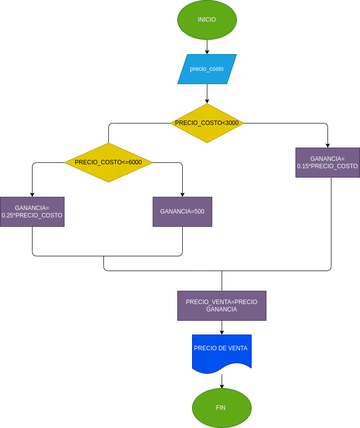

# ANALISIS 

precio_venta= precio al que se vende el producto 

precio_venta= precio_costo+ganancia 

GANANCIA:

15% del precio_costo si es <3000

$500 si precio_costo es [300,000]

25% del precio_costo si es >6000

# DISEÑO 

# construccion 
que se pone aqui? 