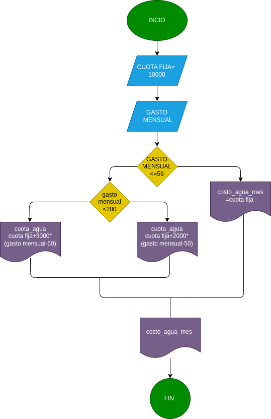

## GASTO DE AGUA 
Programa para saber cuto hay que pagar segun su gasto de agua en m3 
# ANALISIS

-variables de entrada 

M3 = cuantos m3 gasto de agua 
PRECIO_NORMAL = 10000

-variables de proceso 

PAGO = se calcula lo que hay que pagar y se almacena en esta variable 

-variable de salida 

PAGO = se muestra cuanto debe ser el pago por el agua 

# DISEÑO 

